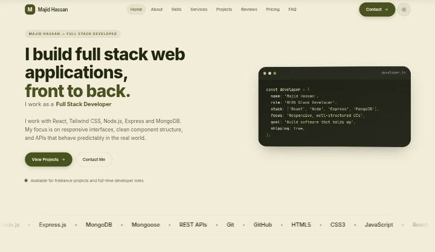

# Portfolio Website 🚀

A modern, fully responsive personal portfolio built with pure HTML, CSS and JavaScript — no frameworks, no build step.

## 🖼️ Banner



## 🔗 Live Demo
[https://portfolio-jvx8nqaqa-majid-hassans-projects-5116236a.vercel.app]

## ✨ Features

- Light and Dark Mode
- Fully Responsive Design
- Smooth Scroll Animations
- Animated Typing Effect
- Stat Counters on Scroll
- Project Cards with Previews
- Contact Form with Validation
- Form Auto-Save (Drafts)
- Copy to Clipboard (Email, Phone, Links)
- WhatsApp Float Button
- Dual Scroll Buttons
- Reading Progress Bar
- Live Clock (Pakistan Standard Time)
- Keyboard Shortcuts
- Custom Scrollbar
- Mobile Friendly Layout
- Modern Olive and Cream Theme

## 🛠️ Tech Stack

- HTML5
- CSS3
- JavaScript (Vanilla)
- Tailwind CSS (CDN)
- Google Fonts (Inter, JetBrains Mono)
- Vercel (Deployment)

## 📁 Project Structure

```

portfolio/
├── index.html
├── css/
│   └── styles.css
├── js/
│   └── main.js
└── banner.jpg

```

## ⌨️ Keyboard Shortcuts

- `T` — Toggle light / dark theme
- `1` — Jump to Home
- `2` — Jump to About
- `3` — Jump to Projects
- `4` — Jump to Contact
- `Esc` — Close mobile menu

## 📦 GitHub Repository

[https://github.com/majidhassan403/Portfolio](https://github.com/majidhassan403/Portfolio)

## 👨‍💻 Developer

**Majid Hassan**

- LinkedIn: [https://www.linkedin.com/in/majid-hassan-0844a33bb/](https://www.linkedin.com/in/majid-hassan-0844a33bb/)
- Instagram: [https://www.instagram.com/majidhassan41/](https://www.instagram.com/majidhassan41/)
- GitHub: [https://github.com/majidhassan403](https://github.com/majidhassan403)
```

---
